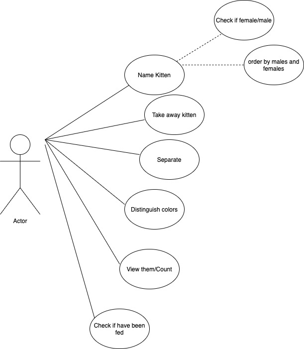

## About The Project

This project was a pain in the ASS bc but I LEARNED THIS doing THIS and THIS

## Use Case Diagram

As a user: AT LEAST 6

- As a user, I want to namekittens
- As a user, I want to take away kittens
- As a user, I want to separate kittens 
- As a user, I want to distinguish kittens by color
- As a user, I want to view the kittens (in what order tho???)/Count
- As a user, I want to check if kittens have been fed

 

## Class Diagram

The `JAVA DEPENDENCIES` view allows you to manage your dependencies. More details can be found [here](https://github.com/microsoft/vscode-java-pack/blob/master/release-notes/v0.9.0.md#work-with-jar-files-directly).
