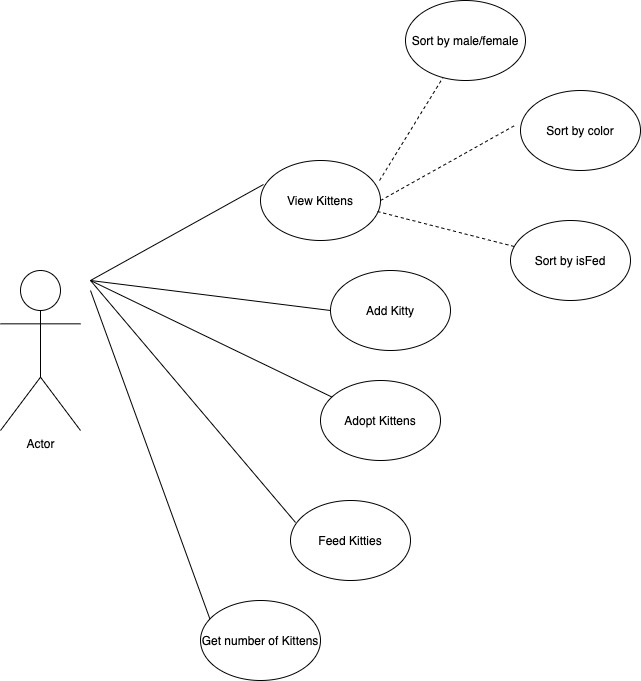
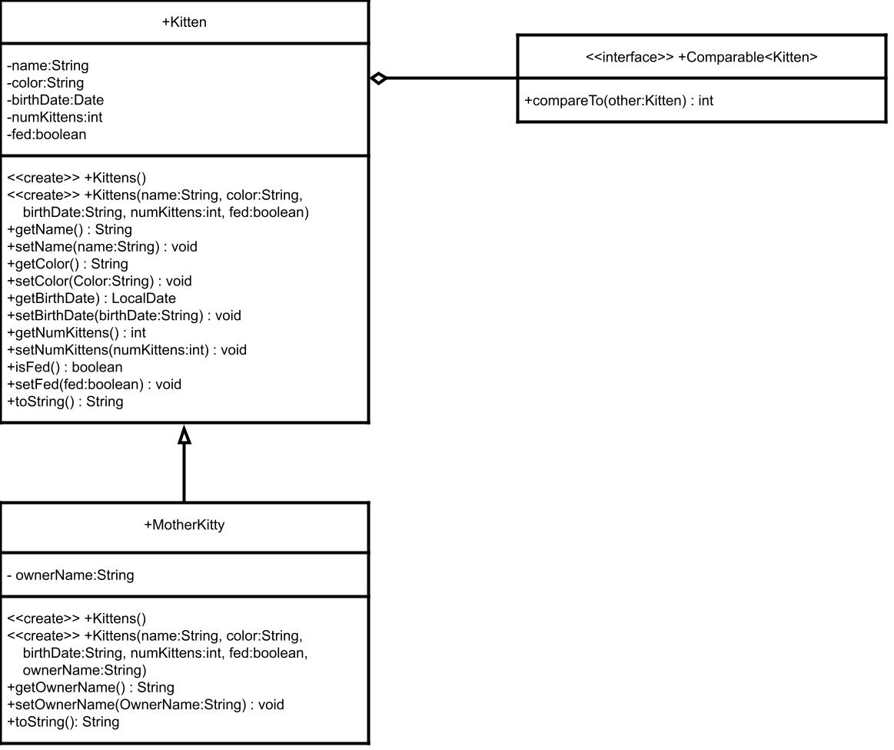

## About The Project

This project used 

## Use Case Diagram

As a user: AT LEAST 6

- As a user, I want to name kittens
- As a user, I want to take away kittens
- As a user, I want to separate kittens 
- As a user, I want to distinguish kittens by color
- As a user, I want to view the kittens (in what order tho???)/Count
- As a user, I want to check if kittens have been fed

 

## Class Diagram

